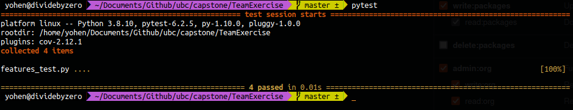

# capstone_group_excercise
main.py is a program to find substrings of a word. For this assignment, there are four features implmented by one developer each. 

### Features

1. first char
2. second char
3. first half substring
4. last half substring

### Testing

The features_test.py program uses the [**pytest**](https://docs.pytest.org/en/6.2.x/contents.html) library to perform tests on the features mentioned. 

It has a test for each feature. 

#### Running the tests

In the same direcotry run `pytest`. 

Please see sample tests in the features_test.py and sample execution of test below:

